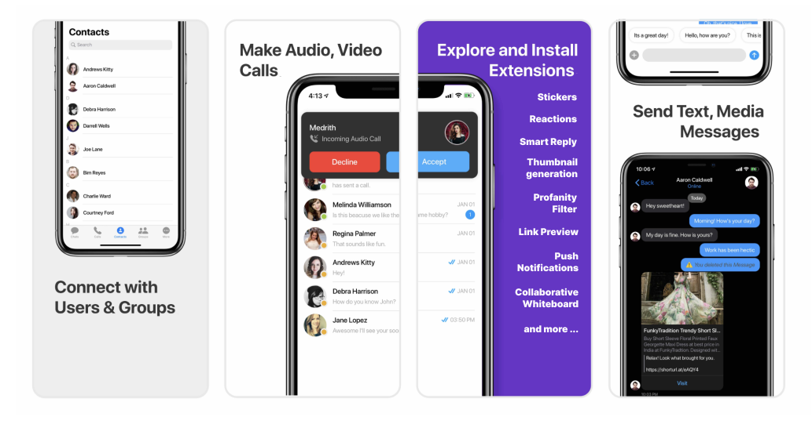

    

        

         
        
    
    
    

  
> **Note**

Version 4 CometChat UI Kits 

We’ve introduced a major update to CometChat UI kits. Version 4 features a modular architecture that gives you enhanced flexibility to build and customize your web and mobile apps. Please switch to the branch [v4](https://github.com/cometchat-pro/cometchat-chat-sample-app-react-native/tree/v4) to check out the sample app based on this version. [Visit our documentation](https://www.cometchat.com/docs/react-native-uikit-beta/overview) to read more about this.
  

# CometChat Kitchen Sink Sample App (React Native)

  

    

        

              
        
    
    
    

  

CometChat Kitchen Sink Sample App (built using **CometChat UIKit**) is a fully functional real-time messaging app capable of private (one-on-one), group messaging, voice & video calling.

## Features

- Login
- Private(1-1) & Group conversations
- Voice & video calling & conferencing
- Rich Media Attachments
- Typing Indicators
- Text, Media and Custom messages
- Read receipts
- Online Presence Indicators
- Message History
- Users & Friends List
- Groups List
- Search by users and groups
- Conversations List
- Threaded Conversations

## Extensions

[Thumbnail Generation](https://prodocs.cometchat.com/docs/extensions-thumbnail-generation) | [Link Preview](https://prodocs.cometchat.com/docs/extensions-link-preview) | [Rich Media Preview](https://prodocs.cometchat.com/docs/extensions-rich-media-preview) | [Smart Reply](https://prodocs.cometchat.com/docs/extensions-smart-reply)| [Emojis](https://prodocs.cometchat.com/docs/extensions-emojis) | [Polls](https://prodocs.cometchat.com/docs/extensions-polls) | [Reactions](https://prodocs.cometchat.com/docs/extensions-reactions) | [Stickers](https://prodocs.cometchat.com/docs/extensions-stickers)

| 
**Note:** Support for Expo CLI based apps. 
                                                                                                                                                                                                  |
| ---------------------------------------------------------------------------------------------------------------------------------------------------------------------------------------------------------------------------------------------------------------------------------------------------------------------- |
| If you are using Expo CLI to build a React Native app, the calling component will not work as our calling component needs native-level changes.However, you can create a React Native app using React Native CLI or use the 'expo eject' command to convert your app from an expo-managed workflow to a bare workflow. |

---

# Installation

1. Simply clone the project from this project. After cloning the repository:

# Setting up the sample app

- Obtain your `APP_ID`, `AUTH_KEY` and `REGION` from [CometChat-Pro Dashboard](https://app.cometchat.com/)

- Open the project.

- Run `cd CometChatWorkspace/src`.

- Modify `APP_ID` and `AUTH_KEY` and `REGION` with your own (update the `CONSTS.js` file).

- Hit `yarn add` to install the packages.

- Run `cd ios` then run `pod install` to install the pods. Once pods are installed run `cd ..` to go back to the root folder.

- Run the app on iOS using `npx react-native run-ios` & on Android using `npx react-native run-android`.

- Select demo users or enter the **UID** at the time of login once the app is launched.

Build and run the Sample App.

| 
**Note:** error:0308010C:digital envelope routines 
                                                                                                                                                                                                                                                |
| ----------------------------------------------------------------------------------------------------------------------------------------------------------------------------------------------------------------------------------------------------------------------------------------------------------------------------------------------------------- |
| If you are using node 17 and above, You may come accross this error code. To solve this please set <b>NODE_OPTIONS</b> with <b>openssl-legacy-provider</b>. Execute below command in terminal  `export NODE_OPTIONS=--openssl-legacy-provider` then `react-native start`.   |

| 
**Note:** generating release APK. 
                                                                                                                                                                                                                                                |
| ----------------------------------------------------------------------------------------------------------------------------------------------------------------------------------------------------------------------------------------------------------------------------------------------------------------------------------------------------------- |
| Setting the below line in android/build.gradle `true` or `false` will determine whether to generate multiple APKs for different CPU architectures or a single APK bundle that works on all devices despite the CPU you're running it on but at the cost of APK bundle size. Default value is `true`  `def enableSeparateBuildPerCPUArchitecture = true` |

# Learn more about UI-Kit

Learn more about how to integrate [UI Kit](https://github.com/cometchat-pro/cometchat-pro-react-native-ui-kit/tree/v3) inside your app.

# Troubleshooting

- To read the full documentation on UI Kit integration visit our [Documentation](https://prodocs.cometchat.com/v3.0-beta/docs/react-native-ui-kit) .

- Facing any issues while integrating or installing the UI Kit please <a href="https://app.cometchat.com/"> connect with us via real time support present in CometChat Dashboard.</a>.

# Contact 📪

Contact us via real time support present in [CometChat Dashboard](https://app.cometchat.com/).
