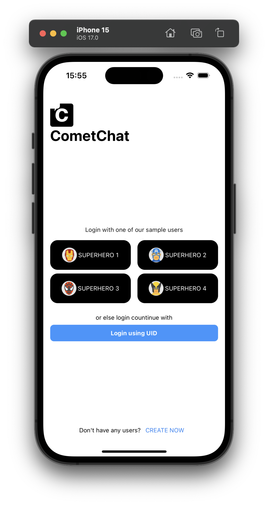

# React Native Sample App by CometChat

This reference application showcases the integration of [**CometChat's React Native UI Kit**](https://www.cometchat.com/docs/v4/react-native-uikit/overview) within an React Native framework. It provides developers with examples of implementing real-time messaging and voice and video calling features in their React Native-based applications.

## Prerequisites
- Visual Studio Code or any other IDE.
- For iOS:
	- XCode
  	- pod (CocoaPods)
	- An iOS device or emulator with iOS 12.0 or above.
- For Android:
	- Android Studio
	- Android device or emulator with Android version 5.0 or above.
- Sign up for a [CometChat](https://app.cometchat.com/) account to get your app credentials: _`App ID`_, _`Region`_, and _`Auth Key`_


## Installation
1. Clone the repository:
    ```
    git clone https://github.com/cometchat/cometchat-sample-app-react-native.git
    ```
2. Install dependencies
    ```sh 
    yarn install
    ```

3. Enter your CometChat _`App ID`_, _`Region`_, and _`Auth Key`_ in the [AppConstants.ts](./AppConstants.ts) file:
    ```typescript
      export const AppConstants = {
         APP_ID: 'APP_ID', // Enter your App ID
         REGION: 'REGION', // Enter your App Region
         AUTH_KEY: 'AUTH_KEY', // Enter your App Auth Key
      }
    ```

4. For iOS, install dependencies after navigating to ios :
    ```sh
      cd ios
      pod install
    ```

5. Run the app on a device or emulator from the repo root.
	```sh 
      yarn start
      yarn run android
      yarn run ios
	```
 
   <div style="
    display: flex;
    align-items: center;
    justify-content: center;">
   
   </div>


## Help and Support
For issues running the project or integrating with our UI Kits, consult our [documentation](https://www.cometchat.com/docs/react-native-uikit/integration) or create a [support ticket](https://help.cometchat.com/hc/en-us) or seek real-time support via the [CometChat Dashboard](http://app.cometchat.com/).
